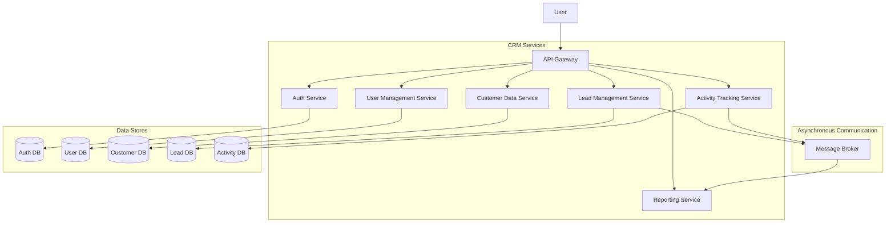

# AgentOrchestratorRuntime — HLD Documentation

*Generated by GitRAG · Commit: unknown*

---

---

## 1.0 Introduction & Executive Summary

This document outlines the architecture for the **Customer Relationship Management (CRM) System**.

The CRM System aims to address the inefficiencies and fragmented nature of current customer interaction tracking and management processes. It will provide a centralized platform for sales, marketing, and customer support teams to access and update customer information, manage leads and opportunities, and track communication history, thereby improving customer engagement and sales conversion rates.

**In Scope:**
*   User and role management.
*   Customer data management (contacts, accounts, opportunities).
*   Lead management and scoring.
*   Activity tracking (calls, emails, meetings).
*   Basic reporting and analytics on customer data.

**Out of Scope:**
*   Advanced marketing automation workflows.
*   Integration with third-party ERP systems.
*   Complex financial reporting.
*   Mobile application development.

This document is intended for **Software Developers**, **Quality Assurance Engineers**, **System Administrators**, and **Product Stakeholders** involved in the development, deployment, and ongoing management of the CRM System.

---

## 2.0 System Requirements & Constraints

*Generation failed for this section: 503 UNAVAILABLE. {'error': {'code': 503, 'message': 'This model is currently experiencing high demand. Spikes in demand are usually temporary. Please try again later.', 'status': 'UNAVAILABLE'}}*

Section instructions were:

### Functional Requirements
* FR-1: Core capability 1 user must be able to do.
* FR-2: Core capability 2 user must be able to do.
### Non-Functional Requirements
* **Scalability:** Expected throughput (e.g., Peak RPS, concurrent users).
* **Availability:** Uptime SLAs (e.g., 99.99% availability).
* **Latency:** Target P95/P99 response times.
### Constraints & Assumptions
* Constraint 1: Budgetary, timeline, or legacy tech stack limitations.
* Assumption 1: Dependencies on third-party APIs.

---

## 3.0 System Architecture & Topology

### Architecture Style
The CRM System will adopt a **Microservices Architecture**. This approach is chosen to promote independent development, deployment, and scaling of individual components, enabling greater agility and resilience. Asynchronous communication will be facilitated through a Message Broker, further decoupling services.

### Topology Diagram

### Component Description
*   **API Gateway:** Acts as the single entry point for all client requests. It will handle concerns such as request routing, authentication and authorization (delegated to the Auth Service), rate limiting, and SSL termination.
*   **Auth Service:** Manages user authentication (login/logout) and role-based authorization for accessing various system functionalities. It interacts with its dedicated `AuthDB`.
*   **User Management Service:** Responsible for CRUD operations on user profiles and managing user roles and permissions. It interacts with its dedicated `UserDB`.
*   **Customer Data Service:** Manages the core customer information, including accounts, contacts, and their relationships. It interacts with its dedicated `CustDB`.
*   **Lead Management Service:** Handles the lifecycle of leads, including creation, scoring, qualification, and conversion. It publishes events to the `Message Broker` for lead-related state changes. It interacts with its dedicated `LeadDB`.
*   **Activity Tracking Service:** Records all customer interaction activities (e.g., calls, emails, meetings). It may publish events to the `Message Broker` to notify other services of new activities. It interacts with its dedicated `ActivityDB`.
*   **Reporting Service:** Aggregates data from various services (potentially via events from the `Message Broker` or direct queries to data stores) to generate basic reports and analytics.
*   **Message Broker:** Facilitates asynchronous communication between microservices. Services can publish events (e.g., `LeadCreated`, `ActivityLogged`) and other services can subscribe to these events to react accordingly, promoting decoupling and enabling event-driven flows.
*   **Data Stores:** Each microservice will manage its own dedicated database (`AuthDB`, `UserDB`, `CustDB`, `LeadDB`, `ActivityDB`) to ensure data independence and allow for technology choices optimized for each service's needs.

---

## 4.0 Data Architecture & Storage Strategy

### Data Flow Description

Data will primarily originate from user interactions through the API Gateway. For instance, when a user creates a new customer record via the UI, the request is routed to the **Customer Data Service** (`services/customer_data/`). This service will then perform necessary validation and persist the new customer entity into its dedicated **Customer Database** (`CustDB`).

Events such as lead creation or activity logging can trigger asynchronous data flows. When a new lead is generated by the **Lead Management Service** (`services/lead_management/`), it will publish an event to the **Message Broker** (`MB`). The **Reporting Service** (`services/reporting/`) can subscribe to these events to update aggregated reporting data in its own data store. Similarly, the **Activity Tracking Service** (`services/activity_tracking/`) will publish activity events to the Message Broker, which can be consumed by the Reporting Service or potentially other future services.

Sensitive data like authentication credentials will be handled by the **Auth Service** (`services/auth/`) and stored securely in the **Auth Database** (`AuthDB`). User profile information will be managed by the **User Management Service** (`services/user_management/`) and stored in the **User Database** (`UserDB`).

### Storage Technologies

*   **Relational (PostgreSQL):** This will be the primary data store for services requiring strong transactional consistency and complex querying capabilities. Examples include the **Customer Data Service** (`services/customer_data/`) for managing accounts, contacts, and opportunities, and the **User Management Service** (`services/user_management/`) for storing detailed user profiles. Strict ACID compliance is paramount for these domains.
*   **NoSQL (DynamoDB):** Chosen for high-throughput, low-latency metadata storage and scenarios where schema flexibility is beneficial. The **Lead Management Service** (`services/lead_management/`) might utilize DynamoDB for storing lead information, particularly if lead scoring or rapid updates are frequent. The **Activity Tracking Service** (`services/activity_tracking/`) could also leverage DynamoDB for storing immutable activity logs, benefiting from its scalability for high write volumes.
*   **Cache (Redis):** Employed for session storage, user authentication tokens, and accelerating frequently accessed data. The **API Gateway** or the **Auth Service** (`services/auth/`) can utilize Redis to cache authentication status and user session information for quick retrieval. Additionally, the **Reporting Service** (`services/reporting/`) may use Redis to cache pre-computed report summaries to reduce database load and improve response times for common queries.

### High-Level Schema

*   **User Service Schema (`UserDB` - PostgreSQL):**
    *   `users` table:
        *   `id` (UUID, Primary Key)
        *   `email` (VARCHAR, Unique, Not Null)
        *   `password_hash` (VARCHAR, Not Null)
        *   `first_name` (VARCHAR)
        *   `last_name` (VARCHAR)
        *   `role_id` (UUID, Foreign Key to `roles` table)
        *   `created_at` (TIMESTAMP WITH TIME ZONE, Not Null)
        *   `updated_at` (TIMESTAMP WITH TIME ZONE, Not Null)
    *   `roles` table:
        *   `id` (UUID, Primary Key)
        *   `name` (VARCHAR, Unique, Not Null)
        *   `permissions` (JSONB)

*   **Customer Data Service Schema (`CustDB` - PostgreSQL):**
    *   `accounts` table:
        *   `id` (UUID, Primary Key)
        *   `name` (VARCHAR, Not Null)
        *   `industry` (VARCHAR)
        *   `website` (VARCHAR)
        *   `created_at` (TIMESTAMP WITH TIME ZONE, Not Null)
        *   `updated_at` (TIMESTAMP WITH TIME ZONE, Not Null)
    *   `contacts` table:
        *   `id` (UUID, Primary Key)
        *   `account_id` (UUID, Foreign Key to `accounts.id`, Not Null)
        *   `first_name` (VARCHAR, Not Null)
        *   `last_name` (VARCHAR, Not Null)
        *   `email` (VARCHAR, Unique)
        *   `phone` (VARCHAR)
        *   `created_at` (TIMESTAMP WITH TIME ZONE, Not Null)
        *   `updated_at` (TIMESTAMP WITH TIME ZONE, Not Null)
    *   `opportunities` table:
        *   `id` (UUID, Primary Key)
        *   `account_id` (UUID, Foreign Key to `accounts.id`, Not Null)
        *   `name` (VARCHAR, Not Null)
        *   `stage` (VARCHAR, Not Null)
        *   `amount` (DECIMAL)
        *   `close_date` (DATE)
        *   `created_at` (TIMESTAMP WITH TIME ZONE, Not Null)
        *   `updated_at` (TIMESTAMP WITH TIME ZONE, Not Null)

*   **Lead Management Service Schema (`LeadDB` - DynamoDB):**
    *   `leads` table:
        *   `lead_id` (UUID, Partition Key)
        *   `first_name` (String)
        *   `last_name` (String)
        *   `email` (String)
        *   `company` (String)
        *   `status` (String)
        *   `score` (Number)
        *   `created_at` (Timestamp)
        *   `updated_at` (Timestamp)

*   **Activity Tracking Service Schema (`ActivityDB` - DynamoDB):**
    *   `activities` table:
        *   `activity_id` (UUID, Partition Key)
        *   `user_id` (UUID)
        *   `subject` (String)
        *   `type` (String, e.g., "CALL", "EMAIL", "MEETING")
        *   `related_to_type` (String, e.g., "CONTACT", "ACCOUNT", "OPPORTUNITY")
        *   `related_to_id` (UUID)
        *   `timestamp` (Timestamp)
        *   `details` (Map)

---

## 5.0 Cross-Cutting Concerns

### Security & Compliance
*   **Authentication:** Implemented via OAuth2 and JSON Web Tokens (JWT) to secure API endpoints and user sessions.
*   **Authorization:** Role-Based Access Control (RBAC) will be enforced to manage user permissions and access to system resources.
*   **Encryption:** Data will be encrypted in transit using TLS 1.3 and at rest using AES-256 encryption standards.

### Observability
*   **Logging:** A centralized, structured JSON logging strategy will be employed across all microservices for consistent log aggregation and analysis.
*   **Metrics:** Key system metrics including CPU utilization, memory usage, and error rates will be collected and monitored.
*   **Tracing:** Distributed tracing will be implemented using OpenTelemetry standards to track requests across multiple microservices, aiding in performance analysis and debugging.

### Resiliency
*   **Circuit Breakers:** Implemented for all external API calls to prevent cascading failures.
*   **Dead Letter Queues (DLQ):** Utilized for asynchronous message processing to handle undeliverable messages and prevent data loss in the event of message processing failures.

---

## 6.0 Deployment & Infrastructure

--- 6.0 DEPLOYMENT & INFRASTRUCTURE ---

### Hosting Environment
The CRM System will be deployed on **Amazon Web Services (AWS)** utilizing **Elastic Kubernetes Service (EKS)** for container orchestration. This provides a scalable, resilient, and managed Kubernetes environment. Supporting infrastructure will include **Amazon RDS** for relational databases, **Amazon ElastiCache** for caching, and **Amazon SQS** or **Amazon MSK** for the Message Broker.

### CI/CD Pipeline
A robust CI/CD pipeline will be established using **GitHub Actions**. The pipeline will automate the following stages:
1.  **Build:** Compiling microservice code, running static analysis, and building Docker images.
2.  **Test:** Executing unit tests, integration tests, and end-to-end tests.
3.  **Scan:** Performing security vulnerability scans on Docker images.
4.  **Deploy:** Releasing container images to the AWS ECR registry and deploying updated Kubernetes manifests to the EKS cluster via a GitOps approach, likely using **ArgoCD**.

### Disaster Recovery
*   **Recovery Time Objective (RTO):** The target maximum tolerable duration for restoring critical system functions after a disaster is **4 hours**.
*   **Recovery Point Objective (RPO):** The target maximum acceptable period in which data might be lost from an operational viewpoint is **15 minutes**.
*   **Deployment Strategy:** A **Multi-AZ (Availability Zone)** deployment strategy will be employed for all critical services and databases within AWS. For enhanced resilience, a **Multi-Region** deployment strategy will be considered for the most critical components, with active-passive failover mechanisms. Automated backups and snapshotting of all persistent data stores will be configured with cross-region replication enabled.

---

## 7.0 Risks, Trade-offs, & Open Items

### Technical Trade-offs

*   **Eventual Consistency vs. Strong Consistency:** The system will favor eventual consistency for many data flows (e.g., reporting, activity tracking) to improve write throughput and scalability. This decision acknowledges that read operations might not immediately reflect the latest writes, which is acceptable for non-critical reporting and audit trails. Strong consistency will be maintained where strictly necessary, such as for user authentication and core customer data integrity managed by the **Customer Data Service** (`services/customer_data/`).
*   **Managed Services vs. Self-Hosted:** The selection of AWS managed services (e.g., EKS, RDS, MSK/SQS) represents a trade-off between operational overhead and vendor lock-in. This choice prioritizes reduced infrastructure management burden, faster provisioning, and leveraging AWS's expertise in scalability and reliability, at the cost of potentially higher direct service costs and less control over the underlying infrastructure compared to self-hosting.

### Identified Risks

*   **Third-Party API Reliability:** The system's reliance on external APIs (e.g., for payment processing, CRM integrations) introduces a risk of latency and availability issues. Failures or slowdowns in these third-party services could directly impact core user flows and overall system performance. Mitigation strategies include implementing robust circuit breakers within the relevant services (e.g., within the **Order Service** if it integrates with payment gateways) and designing fallback mechanisms where feasible.
*   **Kubernetes Complexity:** While EKS offers significant benefits, Kubernetes itself introduces operational complexity. Ensuring the team has adequate expertise in managing, monitoring, and troubleshooting EKS clusters, deployments, and associated resources (like networking and storage) is crucial. Insufficient expertise could lead to deployment failures, performance degradation, or security vulnerabilities.
*   **Data Synchronization Challenges:** With multiple data stores (e.g., **Customer Database** (`CustDB`), **Auth Database** (`AuthDB`), Reporting Service's data store), ensuring data consistency and managing synchronization, especially in an eventually consistent model, presents a risk. Complex queries or data reconciliation issues could arise if not carefully managed.

### Open Items

*   **Data Retention Policy Finalization:** The specific data retention periods for various data types (e.g., logs, user activity, customer data) need to be formally defined and approved in conjunction with legal and compliance teams. This will inform configurations in services like the **Reporting Service** and potentially database lifecycle management.
*   **Message Broker Technology Choice:** A definitive choice between **Amazon SQS** and **Amazon MSK** for the Message Broker needs to be made. This decision will be based on a detailed evaluation of specific requirements for message ordering, throughput, latency, and cost.
*   **Distributed Tracing Implementation Details:** While OpenTelemetry is the standard, the specific instrumentation libraries and backend for collecting and visualizing traces (e.g., Jaeger, AWS X-Ray) require final selection and integration across all services.